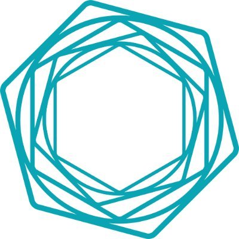
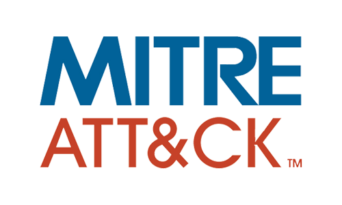
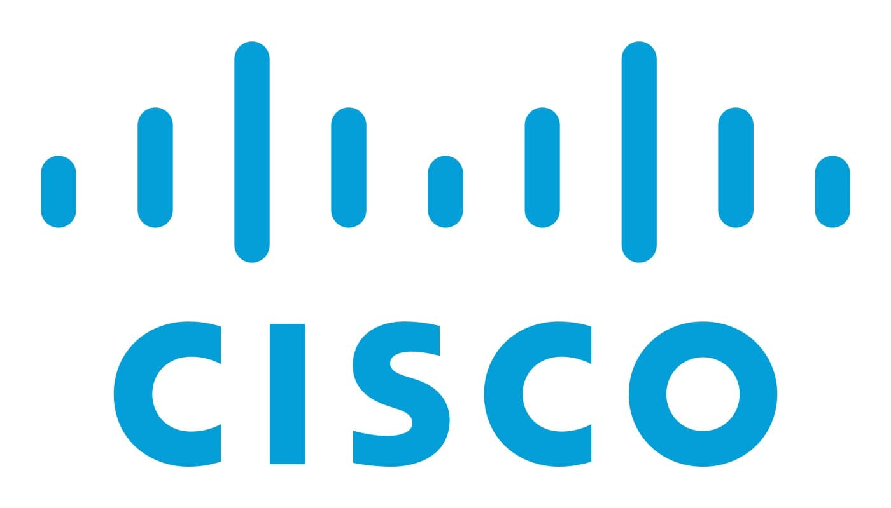

<!--
## Hi there 👋

**arslanadil/arslanadil** is a ✨ _special_ ✨ repository because its `README.md` (this file) appears on your GitHub profile.

Here are some ideas to get you started:

- 🔭 I’m currently working on ...
- 🌱 I’m currently learning ...
- 👯 I’m looking to collaborate on ...
- 🤔 I’m looking for help with ...
- 💬 Ask me about ...
- 📫 How to reach me: ...
- 😄 Pronouns: ...
- ⚡ Fun fact: ...
-->

  

 <h1 align="center">Hi 👋, I'm Arslan Adil</h1>

<h3 align="center">VAPT & Cloud Security Analyst | Cybersecurity Researcher | CEH Certified</h3>

  [LinkedIn](https://linkedin.com/in/arslanadil) •
[Email](mailto:adilarslan26@gmail.com) •
[Resume](./Arslan Adil Resume_VAPT.pdf)

---

## 🚀 About Me

Cybersecurity professional with hands-on experience in Vulnerability Assessment & Penetration Testing (VAPT), Cloud Security, Threat Detection, Security Analysis, and Network Security. Passionate about identifying vulnerabilities, analyzing threats, and improving security posture across web applications, networks, and cloud environments.

* 🔒 VAPT & Cloud Security Analyst at Logging Security Pvt. Ltd.
* 🛡️ CEH & CNSP Certified
* 🎓 B.Tech in Computer Science & Engineering
* 🐧 Linux Enthusiast
* 🌐 Interested in Web Security, Cloud Security, Threat Hunting, and Security Research

---
<h2>🏢 Organizations</h2>

  
  &nbsp;&nbsp;&nbsp;&nbsp;
  
  &nbsp;&nbsp;&nbsp;&nbsp;
  
  &nbsp;&nbsp;&nbsp;&nbsp;
  

<table>
<tr>
<th>Company</th>
<th>Role</th>
<th>Mode</th>
<th>Duration</th>
</tr>

<tr>
<td>Logging Security Pvt. Ltd.</td>
<td>VAPT & Cloud Security Analyst</td>
<td>Part-Time</td>
<td>May 2026 – Present</td>
</tr>

<tr>
<td>Hackerade</td>
<td>Cyber Security Trainee</td>
<td>Part-Time</td>
<td>Sep 2025 – Present</td>
</tr>

<tr>
<td>Avira World</td>
<td>Cyber Security Analyst Intern</td>
<td>Part-Time</td>
<td>Feb 2025 – Apr 2025</td>
</tr>

<tr>
<td>Cranes Varsity</td>
<td>Embedded Systems Intern</td>
<td>Part-Time</td>
<td>Jul 2024 – Feb 2025</td>
</tr>

</table>

---

<h2>🎓 Education</h2>

  
  &nbsp;&nbsp;&nbsp;&nbsp;&nbsp;
  

 

<table>
<tr>
<th>Institution</th>
<th>Qualification</th>
<th>Score</th>
<th>Duration</th>
</tr>

<tr>
<td>C.V. Raman Global University, Bhubaneswar</td>
<td>B.Tech. Computer Science & Engineering</td>
<td>CGPA: 6.66</td>
<td>2021 – 2025</td>
</tr>

<tr>
<td>Firayalal Public School, Ranchi</td>
<td>Class XII</td>
<td>62.3%</td>
<td>2018 – 2020</td>
</tr>

<tr>
<td>Vincent Public School, Bihar</td>
<td>Class X</td>
<td>66%</td>
<td>2018</td>
</tr>

</table>
---

<h2>⚡ Tech Stack</h2>

  
  &nbsp;&nbsp;
  
  &nbsp;&nbsp;
  
  &nbsp;&nbsp;
  
  &nbsp;&nbsp;
  
  &nbsp;&nbsp;
  
  &nbsp;&nbsp;
  
  &nbsp;&nbsp;
  
  &nbsp;&nbsp;
  
  &nbsp;&nbsp;
  
  &nbsp;&nbsp;
  
  &nbsp;&nbsp;
  

 

<b>Cybersecurity:</b> VAPT | Web Application Security | Cloud Security | Bug Hunting | Threat Detection | Security Analysis | Vulnerability Assessment | OWASP Top 10 | MITRE ATT&CK

 

<b>Security Tools:</b> Burp Suite | Metasploit | Nessus | Nmap | Wireshark | Splunk | Vega

 

<b>Systems & Networking:</b> Linux | TCP/IP | DNS | HTTP/HTTPS | Network Security | SIEM | EDR/XDR | Cisco Networking

 

<b>Programming & Databases:</b> Python | C | C++ | MySQL | Database Management

 

<b>Embedded Systems:</b> Keil uVision | LPC1768 | DHT11 | RFID | Microcontrollers

---

<h2>📜 Certifications</h2>

<table>
<tr>
<td width="75%">

<table>
<tr>
<th>Certification</th>
<th>Organization</th>
</tr>

<tr>
<td>Certified Ethical Hacker (CEH)</td>
<td>Hackerade</td>
</tr>

<tr>
<td>Certified Network Security Practitioner (CNSP)</td>
<td>SecOps Group</td>
</tr>

<tr>
<td>Certified Security Engineering & DevSecOps Professional (CSEDP)</td>
<td>SecOps Group</td>
</tr>

<tr>
<td>Diploma in Embedded Development</td>
<td>Cranes Varsity</td>
</tr>

<tr>
<td>Switching, Routing and Wireless Essentials</td>
<td>Cisco</td>
</tr>

</table>

</td>

<td align="center" width="25%">

   

</td>
</tr>
</table>

---

## 🔬 Featured Projects

### Web Application Vulnerability Assessment

* Conducted vulnerability assessments on intentionally vulnerable applications.
* Identified security flaws mapped to OWASP Top 10.
* Created professional security reports using Burp Suite.

### Network Security Assessment using Metasploit

* Performed reconnaissance and service enumeration.
* Validated vulnerabilities in controlled lab environments.
* Analyzed security risks and mitigation strategies.

### DVWA & XVWA Security Labs

* Solved practical web security challenges.
* Exploited and analyzed common web application vulnerabilities.

### Industrial Automation System (Cortex-M3)

* Developed an environmental monitoring system.
* Integrated sensors and automated alert mechanisms.
* Implemented temperature, humidity, smoke monitoring and fan control.

---

## 🎯 Current Focus

* Web Application Penetration Testing
* Security Research
* Threat Detection & Monitoring
* Security Automation with Python
* SOC Operations & Incident Analysis
* Cloud Security Assessments

---

## 📫 Connect With Me

* LinkedIn: https://linkedin.com/in/arslanadil
* Email: [adilarslan26@gmail.com](mailto:adilarslan26@gmail.com)

---

⚡ Security is not a product, but a process.

